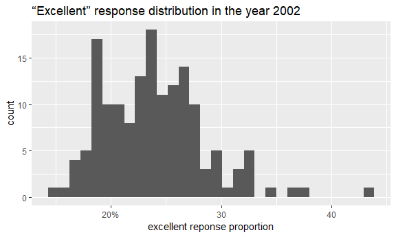
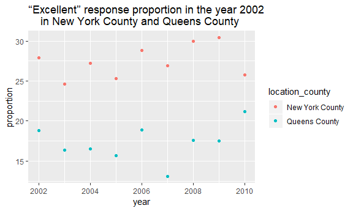

p8105\_hw2\_yw3095
================
Yixuan Wang
September 30, 2018

Problem 1
---------

This problem focuses on NYC Transit data

-   Read and clean the data

``` r
hw2_transit = 
  read_csv("./data/NYC_Transit_Subway_Entrance_And_Exit_Data.csv", 
           col_names = TRUE) %>% 
  janitor::clean_names() %>% 
  gather(key = route_number, 
         value = route_name, 
         route1:route11) %>% 
  select(line:station_longitude,
         route_number, 
         route_name, 
         entry, 
         vending, 
         entrance_type, 
         ada) %>%
  filter(!is.na(route_name)) %>% 
  mutate(entry = ifelse(entry == "YES", yes = TRUE, no = FALSE))
```

**Summary of the Dataset**

-   The dataset contains 10 variables: line, station\_name, station\_latitude, station\_longitude, route\_number, route\_name, entry, vending, entrance\_type, and ada.

-   Steps to clean the data:

1.  Using janitor:clean\_names to transfer all variable names into lowercase and omit the whitespace in variable name.

2.  Using "gather" function to make the data tidy. The route\_number is spread across 11 columns in the original dataset, which correspond to 11 observation times. By gather function, we setting key = route\_number, value = route\_name can fix this problem.

3.  Using "select" function to select the variable we want to be shown in the cleaned dataset.

4.  Using "filter" function to delete the records without a route\_name. Because not all of the stations have 11 routes. After we gathering the route\_number variable, there would be many observations with an "N/A" value in the route\_name variable. We choose to use filter to delete these meaningless records.

5.  Using "mutate" function to convert the entry variable from character (YES vs NO) to a logical variable.

-   The dataset is a 4270 x 10 table.

-   These data are tidy after using "clean\_names", "gather", "select", "filter" functions to clean the data.

**Questions**

-   How many distinct stations are there?

    -   There are 465 distinct stations.

-   How many distinct stations are ADA compliant?

    -   There are 84 distinct stations are ADA compliant.

-   What proportion of station entrances / exits without vending allow entrance?

    -   43.43% of station entrances / exits without vending allow entrance.

-   How many distinct stations serve the A train? Of the stations that serve the A train, how many are ADA compliant?

    -   There are 60 distinct stations serve the A train. Of the stations that serve the A train, 17 stations are ADA compliant.

Problem 2
---------

This problem focuses on the Mr. Trash Wheel dataset.

-   Read and clean the data

``` r
hw2_wheel = 
  read_excel("./data/HealthyHarborWaterWheelTotals2018-7-28.xlsx", 
             range = cell_cols(1:14),
             col_names = TRUE) %>% 
  janitor::clean_names() %>% 
  filter(date != 0) %>% 
  mutate(sports_balls = as.integer(round(sports_balls)))
```

-   Read and clean precipitation data for 2016

``` r
pre_2016 = 
  read_excel("./data/HealthyHarborWaterWheelTotals2018-7-28.xlsx", 
                      sheet = 5,
                      range = cell_rows(2:14),
                      col_names = TRUE) %>%
  janitor::clean_names() %>% 
  mutate(year = 2016)
```

-   Read and clean precipitation data for 2017

``` r
pre_2017 = 
  read_excel("./data/HealthyHarborWaterWheelTotals2018-7-28.xlsx", 
                      sheet = 4,
                      range = cell_rows(2:14),
                      col_names = TRUE) %>%
  janitor::clean_names() %>% 
  mutate(year = 2017)
```

-   Combine the datasets

``` r
pre_comb = 
  bind_rows(pre_2016, pre_2017) %>%
  mutate(month = month.name[month])
```

**Summary**

There are 285 observations in the Mr. Trash Wheel dataset, and the key variables are weight\_tons and homes\_powered. There are 24 observations in the combined precipitatin data for 2016 and 2017, and the key variable is Total.

``` r
filter(hw2_wheel, year == 2016, !is.na(sports_balls)) %>% 
  pull(sports_balls) %>% 
  median()
```

    ## [1] 26

The total precipitation in 2017 is 32.93. The median number of sports balls in a dumpster in 2016 is 26.

Problem 3
---------

-   Upload the dataset from the p8105.datasets package

``` r
devtools::install_github("p8105/p8105.datasets")
library(p8105.datasets)
```

-   Read and clean the data

``` r
hw2_brfss = brfss_smart2010 %>% 
  janitor::clean_names() %>% 
  filter(topic == "Overall Health") %>% 
  separate(locationdesc, into = c("remove", "location_county"), sep = " - ") %>% 
  rename(location_state = locationabbr) %>%
  select(year, location_state, location_county, response, data_value) %>% 
  spread(key = response, value = data_value) %>%
  janitor::clean_names() %>%
  select(year:location_county, excellent, very_good, good, fair, poor) %>% 
  mutate(above_good = excellent + very_good) 
```

**Questions**

``` r
count(hw2_brfss, location_state) %>% 
  arrange(-n) %>% 
  head(1)
```

    ## # A tibble: 1 x 2
    ##   location_state     n
    ##   <chr>          <int>
    ## 1 NJ               146

-   There are 404 unique locations are included in the dataset. There are 51 states in the dataset including the federal district. Every state is represented. NJ is observed 146 times, which is the most.

-   In 2002, what is the median of the “Excellent” response value?

    -   In 2002, the median of the "Excellent" response value is 23.6.

``` r
filter(hw2_brfss, year == 2002, !is.na(excellent)) %>% 
  pull(excellent) %>% 
  median()
```

    ## [1] 23.6

-   Make a histogram of “Excellent” response values in the year 2002.

``` r
res_2002 = filter(hw2_brfss, year == 2002) %>% 
            ggplot(aes(x = excellent)) + 
            geom_histogram() + 
            labs(
    title = "“Excellent” response distribution in the year 2002",
    x = "excellent reponse proportion",
    y = "count") + 
            scale_x_continuous(breaks = c(20, 30, 40), 
                     labels = c("20%", "30", "40")) 
res_2002
```

    ## Warning: Removed 2 rows containing non-finite values (stat_bin).



-   Make a scatterplot showing the proportion of “Excellent” response values in New York County and Queens County (both in NY State) in each year from 2002 to 2010.

``` r
res_all = filter(hw2_brfss, location_county == "New York County" | location_county == "Queens County") %>% 
       ggplot(aes(x = year, y = excellent)) + 
            geom_point(aes(color = location_county)) +
            labs(
    title = "“Excellent” response proportion in the year 2002 
    in New York County and Queens County",
    x = "year",
    y = "proportion")  
res_all
```


